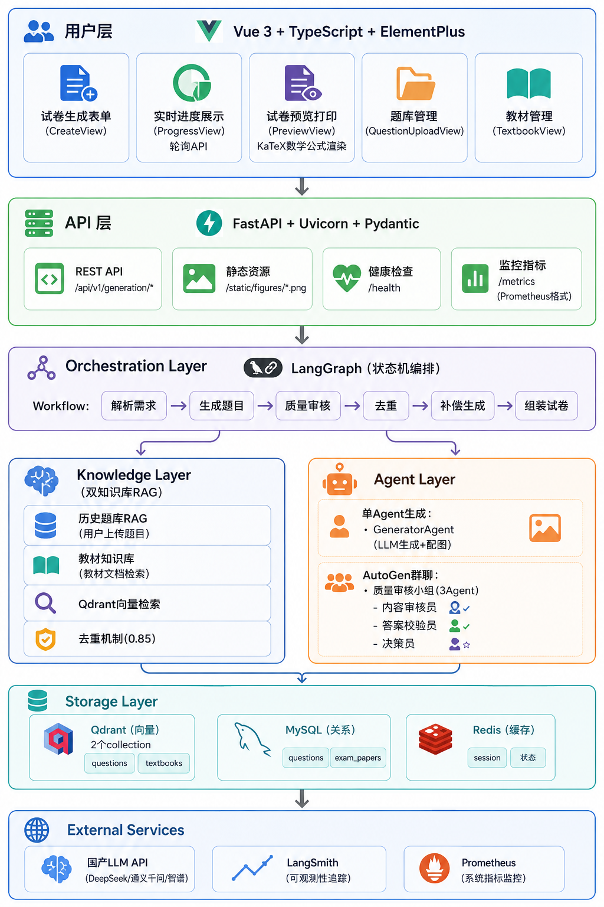
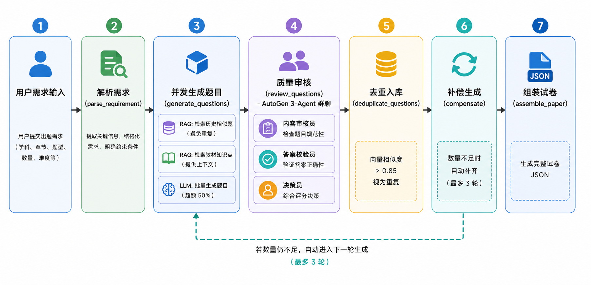
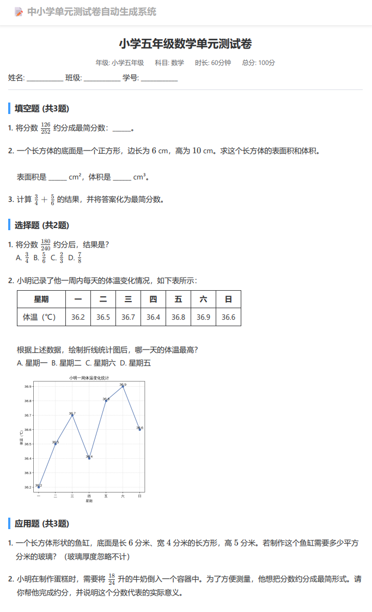
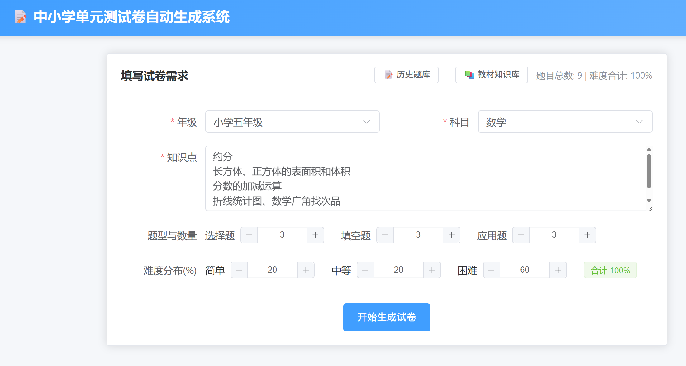
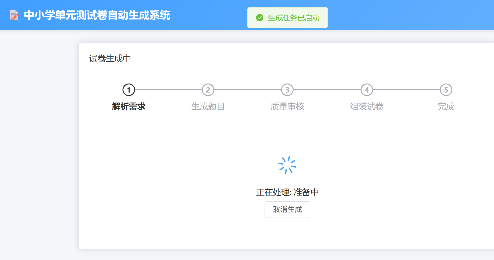
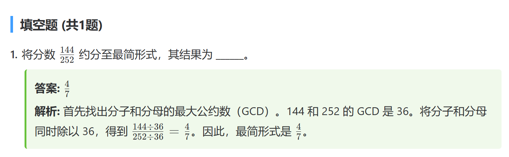
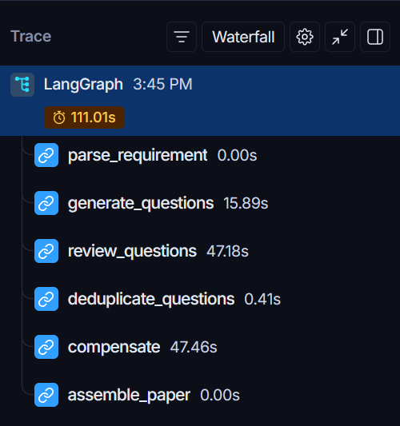

# 中小学试卷自动生成agent系统

> 基于 LangGraph + AutoGen + RAG 的智能试卷生成系统

[](https://www.python.org)
[](https://fastapi.tiangolo.com)
[](https://vuejs.org)
[](https://www.docker.com)

## ✨ 核心特性

- 🤖 **多 Agent 协作**: 基于 AutoGen 实现 3-Agent 群聊质量审核
- 🧠 **双知识库 RAG**: 历史题库去重 + 教材知识库增强生成
- 📊 **完整可观测性**: LangSmith 追踪 + Prometheus 监控 + Grafana 面板
- 🎨 **丰富题型**: 支持数学公式（LaTeX）、配图（几何/统计图）、表格
- 🚀 **一键部署**: Docker Compose 全容器化，2 副本负载均衡

## 🚀 快速开始

### 方式一：Docker 部署（推荐）

```bash
# 1. 克隆项目
git clone https://github.com/pfmpfm/TestPaperGenerator.git
cd TestPaperGenerator

# 2. 配置 API Key（编辑 backend/.env）
LLM_PROVIDER=qwen
QWEN_API_KEY=your-api-key

# 3. 一键启动所有服务
docker compose up -d

# 4. 访问系统
# 前端: http://localhost
# API: http://localhost/docs
# 监控: http://localhost:3000 (admin/admin123)
```

### 方式二：本地开发

```bash
# 1. 启动基础服务
docker compose up -d mysql redis qdrant

# 2. 启动后端
cd backend
source venv/bin/activate && ./start.sh

# 3. 启动前端
cd frontend
nvm use default && npm install && npm run dev
```

## 🏗️ 技术栈

### 后端

- **编排**: LangGraph (workflow) + AutoGen 0.7 (multi-agent)
- **框架**: FastAPI + Uvicorn + SQLAlchemy (async)
- **LLM**: 通义千问 / DeepSeek / 智谱（可切换）
- **存储**: MySQL 8.0 + Redis 7.0 + Qdrant 1.9
- **监控**: LangSmith + Prometheus + Grafana

### 前端

- Vue 3 + TypeScript + Vite
- Element Plus + Pinia + Vue Router
- KaTeX（数学公式渲染）

### 部署

- Docker + Docker Compose
- Nginx（反向代理 + SSL）
- 负载均衡（2 副本 Backend）

## 📦 系统架构



## 📊 生成流程



## 🔧实操演示

#### 生成实例



#### 试卷参数输入



#### 工作流流转中



#### 自动题目解析生成



#### langsmith监控



## 📈 性能指标

- ⚡ **生成速度**: 6 道题约 60 秒（含审核）
- 🎯 **质量评分**: 0.8+ / 1.0（经过 AutoGen 审核）
- 🔄 **去重准确率**: 85%+（向量相似度阈值 0.85）
- 📊 **知识点覆盖**: 100%（round-robin 分配保证）

## 🔧 配置说明

### 环境变量（backend/.env）

```bash
# LLM 配置
LLM_PROVIDER=qwen                              # deepseek/zhipu/kimi/qwen
QWEN_API_KEY=sk-xxx
LLM_HIGH_QUALITY_MODEL=qwen-plus
LLM_COST_EFFICIENT_MODEL=qwen-turbo

# Embedding 配置
EMBEDDING_PROVIDER=qwen
EMBEDDING_MODEL=text-embedding-v3
EMBEDDING_DIMENSION=2048

# 数据库配置
MYSQL_HOST=mysql
REDIS_HOST=redis
QDRANT_HOST=qdrant

# LangSmith 追踪（可选）
LANGCHAIN_TRACING_V2=true
LANGCHAIN_API_KEY=lsv2_xxx
```

详细配置请查看 `backend/.env.example`

## 📊 监控与可观测性

- **LangSmith**: LLM 调用链追踪、Agent 对话记录
- **Prometheus**: 15+ 业务指标（http://localhost:9090）
- **Grafana**: 实时监控面板（http://localhost:3000，admin/admin123）

关键指标：

```promql
# LLM 调用成功率
rate(llm_requests_total{status="success"}[5m]) / rate(llm_requests_total[5m])

# 题目生成数量
sum(rate(questions_generated_total[5m])) by (question_type)

# RAG 去重命中率
rate(rag_duplicate_found_total[5m]) / rate(rag_search_total[5m])
```

## 🧪 测试

```bash
cd backend

# 运行所有测试
make test

# 生成覆盖率报告（目标 85%+）
make coverage

# 查看覆盖率
make cov-report
```

## 📖 API 文档

启动后访问：

- Swagger UI: http://localhost:8000/docs
- ReDoc: http://localhost:8000/redoc

核心接口：

```
POST   /api/v1/generation/start           # 开始生成
GET    /api/v1/generation/status/{id}     # 查询进度
GET    /api/v1/generation/result/{id}     # 获取结果
POST   /api/v1/questions/upload            # 上传历史题目
POST   /api/v1/textbook/upload             # 上传教材文档
```

## 📁 项目结构

```
TestPaperGenerator/
├── backend/                    # FastAPI 后端
│   ├── app/
│   │   ├── agents/             # Agent 实现
│   │   ├── workflows/          # LangGraph workflows
│   │   ├── tools/              # Agent 工具（配图/知识库）
│   │   ├── api/                # API 路由
│   │   └── core/               # 核心配置
│   ├── config/                 # 配置文件
│   ├── tests/                  # 测试用例
│   └── Dockerfile              # 多阶段构建
├── frontend/                   # Vue3 前端
│   ├── src/
│   │   ├── views/              # 5 个页面
│   │   ├── components/         # 可复用组件
│   │   └── api/                # API 调用封装
│   └── package.json
├── nginx/                      # Nginx 配置
├── prometheus/                 # Prometheus 配置
├── grafana/                    # Grafana Dashboard
├── docker-compose.yml          # Docker Compose
└── README.md
```

## 🎯 使用流程

1. **配置需求**: 选择年级、科目、知识点、题型、难度
2. **生成试卷**: AI 自动生成，实时显示进度（约 60 秒）
3. **质量审核**: 多 Agent 协作审核，过滤低质量题目
4. **预览打印**: 在线预览，支持打印

## 🛠️ 常用命令

```bash
# 查看服务状态
docker compose ps

# 查看日志
docker compose logs -f backend

# 重启服务
docker compose restart backend

# 扩展 Backend 副本
docker compose up -d --scale backend=4

# 备份数据库
docker compose exec mysql mysqldump -u root -p exam_generator > backup.sql
```

📄 许可证

MIT License

## 🤝 贡献

欢迎提交 Issue 和 Pull Request！

---

**⭐ Star 本项目，关注更多 AI Agent 应用！**
